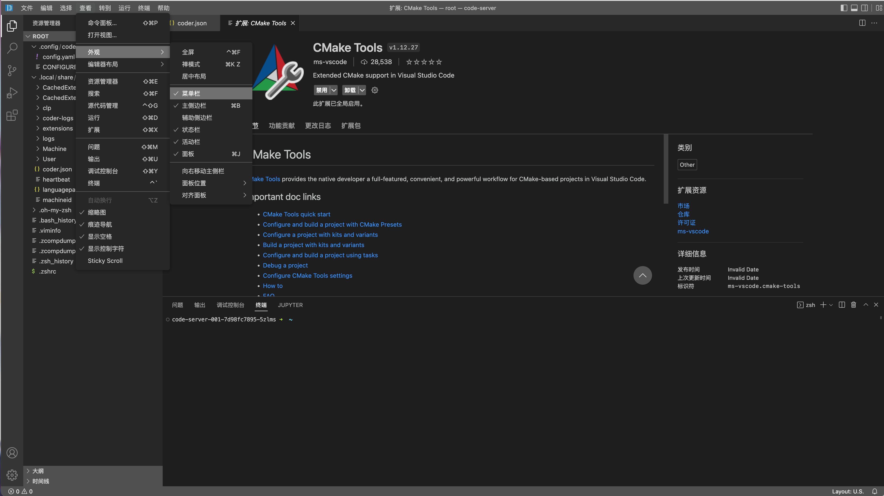

# Introduction to Cloud IDE

## 使用条件

Cloud IDE依托交大云平台部署，因此需要交大校园网。[VPN设置指南](https://net.sjtu.edu.cn/wlfw/VPN.htm)

## 登陆

访问 [https://coder.ice3402p.xyz/你的ID/](https://coder.ice3402p.xyz/你的ID/)
初始密码为`speit`

你将在浏览器中得到一个可用的云编程平台。

视频教程请看[Introduction to Cloud IDE video](https://vshare.sjtu.edu.cn/play/f37135e3c0106868097cb4c5d985b836)。同学们实际拿到手的环境是装好插件并配置好的开箱即用的环境，和视频里的有出入，其他操作没有不同。

> URL结尾的`/`是必须的

## 修改密码

建议最开始修改密码。

修改`/root/.config/code-server/config.yaml` 文件，保存

```yaml=
bind-addr: 0.0.0.0:8080 # 不要修改
auth: password # 不要修改
password: speit # 改成新密码
cert: false # 不要修改
```

> 如果要使用纯数字密码，需要在密码外加上单引号，例如
> ```yaml
> bind-addr: 0.0.0.0:8080 # 不要修改
> auth: password # 不要修改
> password: '31415926535' # 改成新密码
> cert: false # 不要修改
> ```
> 强烈**不推荐**使用纯数字作为密码

输入`restart-container`，重启容器

> 重启容器将导致非`/root`路径下的内容丢失

## 额度限制

每个容器有8GiB的持久存储限额（仅限`/root/`目录），并且会被各种插件占去3GiB左右。只有`/root`目录下的文件会被持久存储，但也仅限于本次课程的时段，因此不要在容器中存放珍贵文件。

容器内存限制为4GiB，超出内存限制的程序可能会被杀死。

## 上手指南

在此处输入密码


设置简体中文


建议打开菜单栏常驻显示




确保下列插件安装:

- clangd
- cmake
- cmake tools
- makfile

## 作业模版

`/root/Templates/homework` 下有基于作业提交模版，同学们可以模仿，不强制要求掌握CMake

## 重置容器

如果搞错了环境、无法重新安装删除的插件，可以重置容器。这将会重置所有的编辑器设置、安装的插件和软件，仅保留`/root`目录下的用户文件。强烈建议重置容器前备份自己的作业、笔记以及各种其他文件

若要重置容器，只需要删除`/root/.config/code-server/CONFIGURED`文件，然后使用`restart-container`命令触发容器重启

> `restart-container` 将清除所有系统层面的更改（例如`apt-get`安装的软件、`/etc`目录下的配置文件，但是不会清除插件


## 特别提醒

你也可以用这个容器环境跑Python脚本

除了此次课程的容器外，建议同学们在平时不要使用root用户登陆自己的Linux操作系统。由于容器化技术，本容器中的root用户并非真正的root用户，其影响局限于容器内，一旦发生问题重置容器即可。
