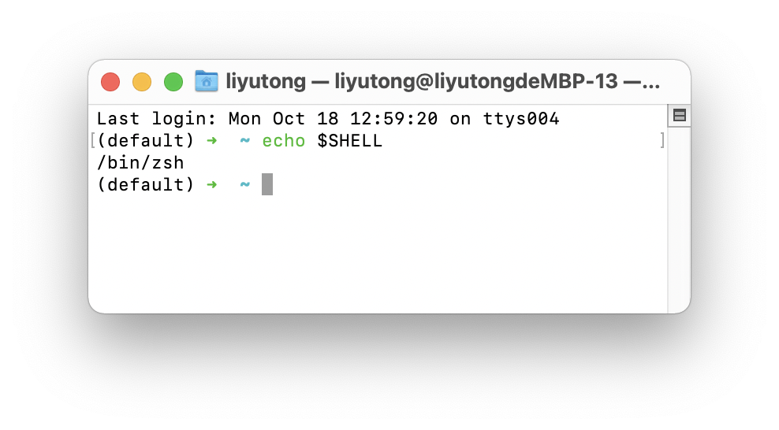

# Introduction to Shell

## Shell 是什么

操作系统有一个叫做 内核 (Kernel) 的东西，它管理着整台计算机的硬件，是现代操作系统中最基本的部分。因此，需要一个专门的程序，它接受用户输入的命令，然后帮我们与内核沟通，最后让内核完成我们的任务。这个提供用户界面的程序被叫做 Shell (壳层)


### Unix 及类 Unix 系统的Shell

(也就是Linux和MacOS中的Shell)

- `sh` (Bourne shell)，最经典的 Unix shell
- `bash` (Bourne-Again shell)，目前绝大多数 Linux 发行版的默认 shell
- `zsh` (Z shell)，配合[oh-my-zsh](https://ohmyz.sh/)十分强大
- `fish` (Friendly interactive shell)，专注于易用性与友好用户体验的 shell

### Windows 下的Shell

- cmd.exe (命令提示符)
- PowerShell。

> Powershell 中输入`wsl`后会进入Linux，此时shell提示字符会发生改变

在本门课程中，我们使用Windows的同学被使用虚拟机运行Linux操作系统并使用该系统参加课程。因此，同学们接触到的Shell，大多为Unix以及类Unix系统的Shell

## Terminal 人与机器交互的接口

终端只是一种用于与计算机进行交互的输入输出设备，其本身并不提供运算处理功能。

随着计算机的进化，我们已经见不到专门的终端硬件了，取而代之的则是键盘与显示器。这时候我们就需要一个程序来模拟传统终端的行为，即 终端模拟器 (Terminal Emulator).

一个终端模拟器的标准工作流程是这样的：

1. 捕获键盘输入
2. 将输入发送给命令行程序（程序会认为这是从一个真正的终端设备输入的)
3. 拿到命令行程序的输出结果 (`stdout` 以及 `stderr`)
4. 调用图形接口 (比如 X11) ，将输出结果渲染至显示器

例如MacOS下的Terminal就是模拟器，它运行的可以是`bash`或`zsh`. Windows下的PowerShell程序其实是PowerShell的同名**模拟器**

## 基本论断

- Terminal只是使用shell的手段。我们要学习的是如何与shell打交道
- 在使用Shell的过程中，对**当前的目录**必须要心中有数

在本门课程中，我们需要打交道的Shell主要是Linux/MacOS下的Unix Shell，因此下文将围绕Unix Shell命令展开。给出的例子不一定适用于Powershell和命令提示符（CMD）。

## 简单的Shell逻辑

Shell接受的是字符串格式的命令。一般来说，我们用**空格**来分割参数，用换行符来标志一条命令的结束，用`\`来输入多行命令。一条shell命令的第一个参数一般是可执行文件。

## Shell 的环境变量

在shell中，存在一种叫做变量的概念。这种变量可以通过`$`符号访问。例如`$USER`变量就记录了当前登陆的用户名

```bash
echo $USER                                
<user_name>
```

`$SHELL`变量就记录了当前的shell



> `echo` 命令可以输出一串字符

## Shell是如何执行命令的

以启动`jupyter-notebook` 的命令为例

```bash
jupyter notebook
```

也可以是这样（多行输入）

```bash
jupyter \
notebook
```

这里`jupyter`是可执行文件，notebook是参数，我们意图启动`jupyter`的`notebook`功能。

`which`命令可以查看一个可执行文件的真正路径:

```bash
$ which jupyter       
/opt/homebrew/Caskroom/miniforge/base/envs/default/bin/jupyter
```

也就是说，我们运行的`jupyter`，其实是`/opt/homebrew/Caskroom/miniforge/base/envs/default/bin/jupyter`

shell 是怎么知道`jupyter`命令的真正路径呢？这多亏了`$PATH`环境变量。在众多环境变量中`$PATH`变量有特殊的意义。`$PATH`变量是一串用`:`分割的字符。每一段都表示了一个路径。shell会在这些路径中查找可执行文件来运行

例如，当用户输入`jupyter notebook`时，shell会在`$PATH`中的所有路径中查找`jupyter`.`jupyter`位于`/opt/homebrew/Caskroom/miniforge/base/envs/default/bin/`中，而这个目录被添加到了`$PATH`变量里，因此运行成功

如果我们输入的命令是

```bash
./jupyter notebook
```

其中`./`代表了当前目录

则shell不会去`$PATH`中查找`jupyter`，而是会在当前目录下查找。这是shell的运行机制

我们自己编译的程序，通常不存在于`$PATH`所记录的目录中，因此需要用`./`等路径来让shell在当前或**其他确定的路径**下搜索我们自己编译的程序

## Shell和gcc

从上一章节可知，我们使用`gcc`命令，其实是调用了`which gcc`所对应的`gcc`可执行文件。

`gcc`接受很多参数，最基本的用法是

```bash
gcc <源代码文件> -o <可执行文件>
```

> 可执行文件一定不能和源代码文件重名，否则会覆盖源代码

启用所有警告

```bash
gcc <源代码文件> -o <可执行文件> -Wall
```

详细用法见[GCC 参数详解](https://www.runoob.com/w3cnote/gcc-parameter-detail.html)

## Shell 小技巧

`&&`符号可以连续执行两条的命令

```bash
gcc main.c -o main && ./main # 先编译后运行
```

`>` 可以把上一个程序的输入重定向到一个文件。假设我们有一个会输出"Hello, world!"的程序`./hello_world`

```bash
./hello_world > output.txt # 输出到output.txt
$ cat output.txt
Hello, world!
```

`|` 可以把上一个程序的输出定向到下一个程序的输入

```bash
cat input.txt | ./my_program_using_scanf # 从input.txt读取
```

## Shell 脚本

shell 可以从一个文本文件读取shell语句然后依次执行。这样的文件叫做shell脚本。shell脚本一般以`.sh`结尾

假设我们有一个这样的文件`helloworld.sh`

```bash
#!/bin/bash
set -e
mkdir build
gcc main.c -o ./main -Wall
.main
rm ./build/main
```

> `#!/bin/bash`表示脚本使用`/bin/bash`运行
> `set -e` 使脚本遇到错误就立即退出，不再执行接下来的代码

我们可以用两种方式执行这个脚本：

1. `bash helloworld.sh`
2. `chmod +x helloworld.sh && ./helloworld.sh`

> `chmod` 用于改变文件权限，`+x`选项表示添加执行权限. 如果不添加权限会无法直接执行脚本

Shell脚本可以非常的复杂，详见[Shell 教程](https://www.runoob.com/linux/linux-shell.html)
