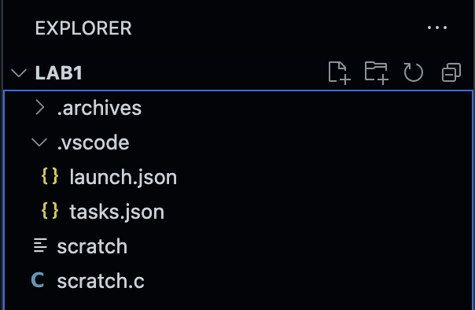
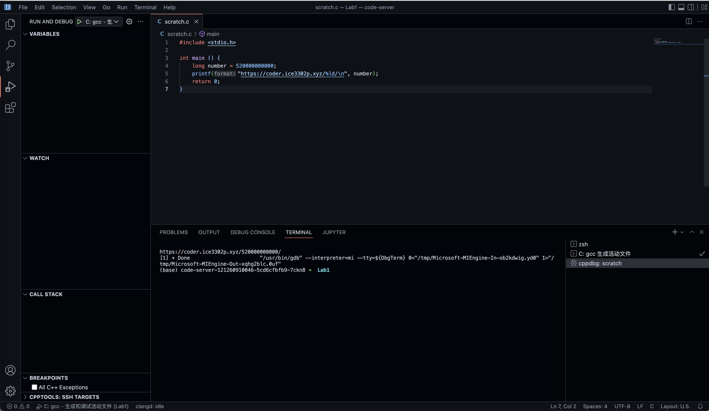

# 关于如何配置launch.json和tasks.json，以使用调试工具

首先在当前打开的项目下创建一个.vscode目录，在该目录下创建launch.json和tasks.json文件，注意不要搞错文件名。（这里假设`scratch.c`是我们正在编写运行的代码）



总体来说，调试任务由`launch.json`管理。在launch.json中填写下列内容。相关字段的含义如下

```json
{
    // 使用 IntelliSense 了解相关属性。 
    // 悬停以查看现有属性的描述。
    // 欲了解更多信息，请访问: https://go.microsoft.com/fwlink/?linkid=830387
    "version": "0.2.0",
    "configurations": [
        
        {
            "name": "C: gcc - 生成和调试活动文件", // 独一无二的名称
            "type":"cppdbg", // 无需修改
            "request": "launch", // 无需修改
            "program": "${fileDirname}/${fileBasenameNoExtension}", // 启动的程序路径，无需修改，见下文
            "args": [], // 额外的启动参数
            "stopAtEntry": false, // 无需修改
            "cwd": "${fileDirname}", // 运行的目录，默认为当前目录
            "environment": [], // 额外的环境变量
            "externalConsole": false, // 如果是本地，可以改为true来使用scanf输入；云端IDE请设置为false
            "MIMode": "gdb", // 调用的调试工具，无需修改
            "preLaunchTask": "C: gcc 生成活动文件", // 预先运行的生成任务，见下文
        }
    ]
}
```

我们可以看到，`launch.json`定义了一个叫做`C: gcc - 生成和调试活动文件`的调试任务。该任务针对的目标程序是`${fileDirname}/${fileBasenameNoExtension}`。运行该任务时，`${fileDirname}`会被替换成具体的目录，`${fileBasenameNoExtension}`会被替换为*除去拓展名的文件名*。例如，对`./scratch.c`执行该任务，调试工具将会寻找`./scratch`程序来运行。

我们要始终明确一点，`launch.json`中定义的这个任务始终针对的是**二进制程序**，而不是源代码。而源代码一旦发生修改，就需要重新编译。VSCode为此提供了`preLaunchTask`机制。`preLaunchTask`指定的任务将先于当前任务运行。这些任务由`tasks.json`管理

在`tasks.json`中填写下列内容

```json
{
    "tasks": [
        {
            "type": "cppbuild", // 不要修改
            "label": "C: gcc 生成活动文件", // 独一无二，和launch.json中的preLaunchTask匹配
            "command": "/usr/bin/gcc", // 调用gcc来编译
            "args": [
                "-fdiagnostics-color=always",
                "-g",
                "${file}", // 源文件
                "-o",
                "${fileDirname}/${fileBasenameNoExtension}" // 生成的文件
            ], // 编译参数，酌情修改
            "options": {
                "cwd": "${fileDirname}" // 工作目录，酌情修改
            },
            "problemMatcher": [
                "$gcc" // 无需修改
            ],
            "group": {  // 无需修改
                "kind": "build",
                "isDefault": true
            },
            "detail": "调试器生成的任务。" // 随便取个名字
        }
    ],
    "version": "2.0.0"
}
```

`task.json`中定义的这个task会吧`${file}`替换成当前文件，然后编译出`${fileDirname}/${fileBasenameNoExtension}`。还是以`scratch.c`文件为例，这个任务等价于执行`gcc scratch.c -o ./scratch`

现在我们尝试一下。首先确保打开scratch.c文件并使其置于主面板中。然后点击调试选项卡。调试工具会自动识别`launch.json`文件，并显示一个绿色的运行按钮


点击这个按钮就可以编译运行程序了



如果设置了断点，则程序会停在断点处。可以通过调试面板控制程序的行为


