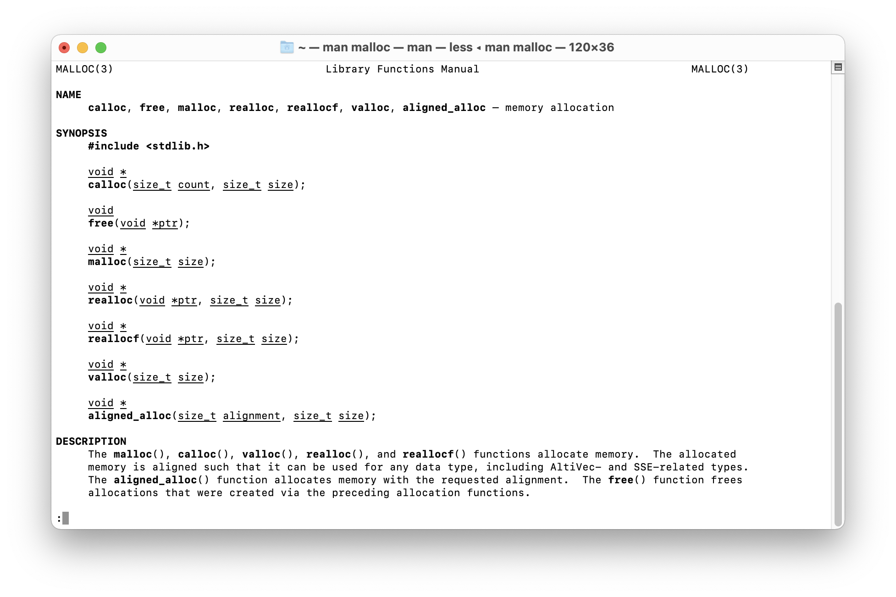

# Lab 5 - Struct

## Task 0 Struct

设计`struct person_t`，该结构体包含以下字段：
  
- `name` 名字
- `age` 年龄
- `gender` 性别
- `type` 类型（学生，老师）
- `grade/domain` 年级，如果是学生就是年级，是老师就是科研领域
- `college` 学院
- `number` 学号/工号
- `email` 邮箱
- `id` 身份证号
- `phone` 手机号码
- `birthday` 生日

想一想：

- 如何验证这些字段的有效性？
- 应该用怎样的数据类型存储各个字段(`int`?, `char`?, `enum`, `struct`?)
- 如何实现`grade/domain`字段？（假设保存科研领域为字符数组类）
- 如何保存生日
- 如何验证身份证号，手机号码，邮箱的有效性？

## Task 1* Union

我们会介绍一种新的数据类型，`union`联合体

```c
union _grade_domain_t{
    int grade;
    char domain[20];
};
typedef union _grade_domain_t grade_domain_t;
```

`union`是一种特殊的数据类型，也是一种构造类型的数据结构。在一个`union`内可以定义多种不同的数据类型， 一个被说明为该`union`类型的变量中，允许装入该`union`所定义的任何一种数据，这些数据共享同一段内存，以达到节省空间的目的。

因此：

- `union`的实际意义取决于读取方式
- 后装入的值会覆盖之前装入的值
- `union`的占用空间取决于其中最大的数据类型

### 任务

完成`struct person_t`的设计。

## Task 2* Mod

修改`struct person_t`结构体，使其增加以下项目

- `is_present` 是否在校
- `is_infected` 是否感染新冠
- `is_cured` 是否已经治愈
- `is_curing` 是否正在治疗
- `is_inoculated_1` 是否已经接种疫苗第一针
- `is_inoculated_2` 是否已经接种疫苗第二针
- `is_inoculated_3` 是否已经接种疫苗第三针
- `is_alive` 是否存活

想一想：

- 是否有办法优化存储空间？

### bit-field

bit-field（位域）是一种struct变体。 位域的表达方式就是变量名:位数。

```c
struct {
    unsigned int is_present:1;
    unsigned int is_infected:1;
    unsigned int is_cured:1;
    unsigned int is_curing:1;
    unsigned int is_inoculated_1:1;
    unsigned int is_inoculated_2:1;
    unsigned int is_inoculated_3:1;
    unsigned int is_alive:1;
}
```

在上面的例子里，每一个项目都用一个bit存储，整个结构体大小和`unsigned int`相同

又如

```c
struct {
    int day:5;
    month:4;
    year:14;
}
```

用5bit存储日期，4bit存储月份，14bit存储年份

## Task 3

设计一段程序，从键盘读取字符并构建`struct person_t`结构体，然后打印出`struct person_t`的信息

演示：

```console
(default) ➜  ~ ./main
> addperson
> Please Input the name of person: david
> Please Input the age of person: 22
> ...
> The person name is david, age 22, ...
```

## Task 4

设计一个存储机制，使得程序可以添加多个`struct person_t`，并且按需要打印他们

演示

```console
(default) ➜  ~ ./main
> addperson
...
> addperson
> printperson 1
...
> printperson 2
```

想一想：

- 使用数组存放有什么劣势？

## Task 5 学习 Malloc

我们接下来尝试使用`malloc`改写程序

`malloc` 位于`<stdlib.h>`内，使用前需要`#include<stdlib.h>`

```c
#include <stdlib.h>
/** 连续分配 count 个 size 大小的内存，并将其填充为0**/
void * calloc(size_t count, size_t size);

/** 释放分配的内存**/
void free(void *ptr);

/** 分配 size 大小的内存**/
void * malloc(size_t size);

/** 收回ptr的内存，重新分配 size 大小的内存，返回新指针
如果是扩大内存操作会把 ptr 指向的内存中的数据复制到新地址（新地址也可能会和原地址相同，但依旧不能对原指针进行任何操作）；如果是缩小内存操作，原始据会被复制并截取新长度。
**/
void * realloc(void *ptr, size_t size);

/** 分配 size 大小的内存， 对齐到页**/
void * valloc(size_t size);

/** 分配 size 大小的内存， 对齐到制定大小**/
void * aligned_alloc(size_t alignment, size_t size);

```



### 堆和栈

> [练习17：堆和栈的内存分配](https://wizardforcel.gitbooks.io/lcthw/content/ex17.html)

在Python中，我们只要创建对象或变量就好了，不用管它们是存放在栈上或堆上（事实上，Python完全不会把变量放在栈上，它们都在堆上）

然而C使用了CPU真实的机制来完成工作，因此C程序访问的内存包括了**栈**的区域，以及另外一块叫做**堆**的区域。它们的差异取决于取得**储存空间的位置**。

### 内存管理

堆是你电脑中的剩余内存，你可以通过`malloc`访问它来获取更多内存，OS会使用*内部函数*为你注册一块内存区域，并且返回指向它的指针。当你使用完这片区域时，你应该使用`free`把它交还给OS，使之能被其它程序复用。如果你不这样做就会导致程序“泄露”内存。

栈是一个特殊的内存区域，它储存了每个函数的创建的临时变量，它们对于该函数为局部变量。它的工作机制是，函数的每个函数都会“*压入*”栈中，并且可在函数内部使用。它是一个真正的栈数据结构，所以是后进先出的。使用栈的优点是，当函数退出时C编译器会从栈中“弹出”所有变量来清理。这非常简单，也防止了栈上变量的内存泄露。

### 原则

如果你的变量并不是从malloc中获取的，也不是从一个从malloc获取的函数中获取的，那么它在栈上。

### Q&A

#### 我是否可以用一个栈上的变量保存指针

可以，但是如果你从malloc获取了一块内存，并且把指针放在了栈上，那么当函数退出时，指针会被弹出而丢失。

#### 我是否可以在栈上放大量数据

如果你在栈上存放了大量数据（比如大结构体和数组），那么会产生“栈溢出”并且程序会中止。这种情况下应该通过malloc放在堆上。（还记得查找素数的问题吗？）

栈的限制可以通过`ulimit -s`命令查看

#### 我是否可以不free申请的内存

当一个程序退出时，OS会为你清理所有的资源，但是有时不会立即执行。因此请总是free内存。

### 总结

- `calloc`,`malloc`,`valloc`会从堆区分配内存（什么是堆区？）
- `free` 释放这块内存

## Task 6 Valgrind

[Valgrind 介绍](https://valgrind.org/)

### 安装

Ubuntu

```console
sudo apt-get install valgrind
```

Mac

```console
brew install valgrind
```

Valgrind 不支持Windows。作为替代，可以使用Deleaker工具（Visual Studio的拓展）

### 使用

```console
valgrind --leak-check=yes ./main
```

```console
valgrind ./main
```

## Task 7

用malloc分配一个结构体，对其进行操作，验证所学的知识